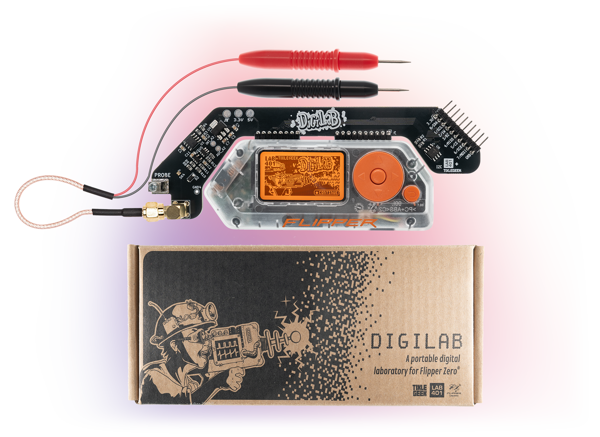
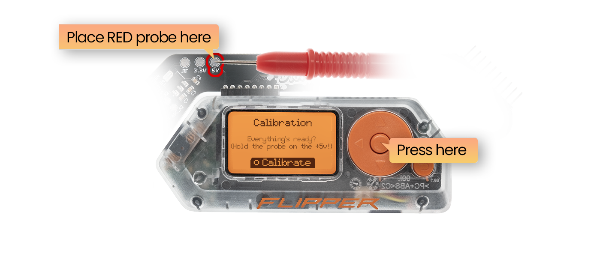
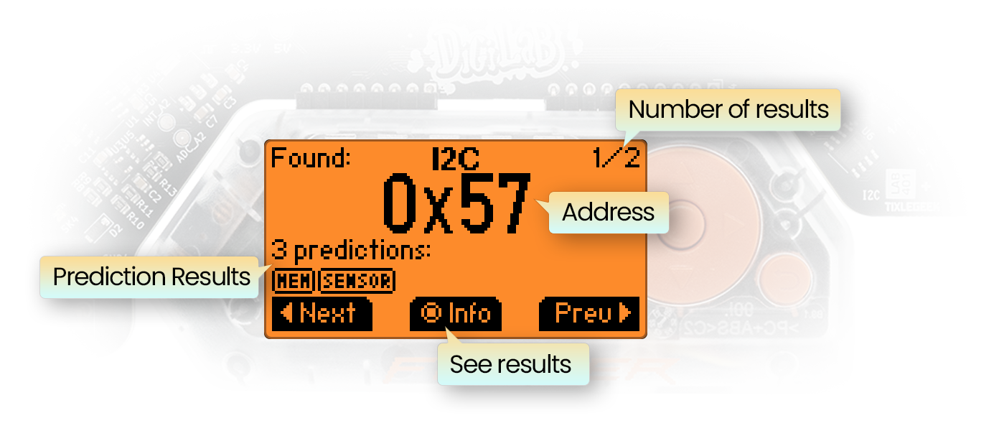
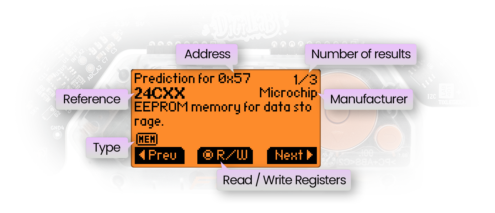
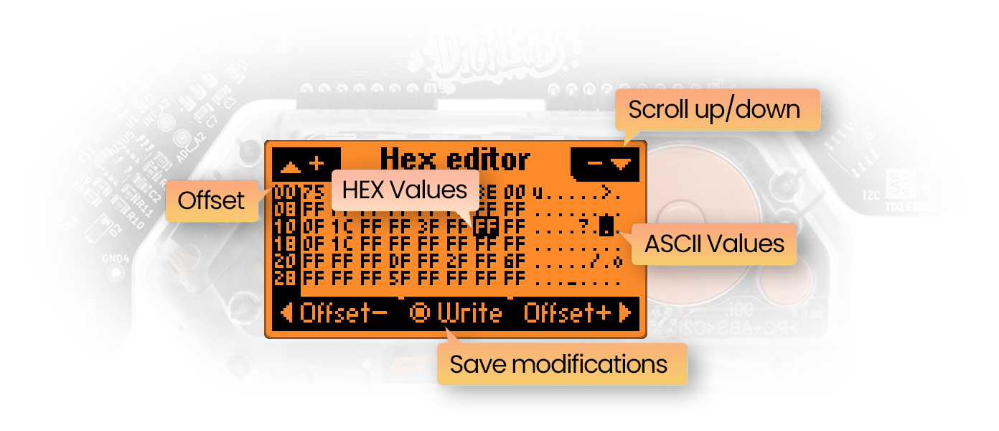

# Lab401 DigiLab

## Overview

[Lab401's DigiLab](https://lab401.com/products/lab401-digilab) by [tixlegeek](https://cyberpunk.company/) is a [Flipper Zero®](https://flipperzero.one/) accessory that introduces a new way to explore electronics. Designed to be the first tool you reach for when you're developing, debugging, tinkering or exploring digital electronics.

### Key Features

- **Discover signals** via the Scope application
- **Probe for voltages and frequencies** in the Probe function  
- **Detect, discover and interact** with SPI & I2C devices directly via the SPI Probe and I2C Probe functions

### What Makes DigiLab Special

The DigiLab allows you to **feel** the circuits you're exploring by combining:
- RGB LED
- Flipper's speaker
- Vibration motor

This combination lets you:
- **See** voltage fluctuations
- **Hear** the difference between different protocols
- **Feel** the different signals flowing around a circuit

### Versatile Usage Modes

- **Desktop mode** - with included custom-designed mini-probes
- **Portable mode** - with included probe tip

### Compatibility & Open Source

- Compatible with the full range of **BusPirate accessories**
- **100% Open Source and Open Hardware**
- Perfect combination of functional, fun and educational

---

## Getting Started

### Purchase & Setup

1. Purchase your DigiLab from [Lab401's](https://www.lab401.com) or authorized resellers
2. Unbox your device and familiarize yourself with it
3. Install the "Lab401 DigiLab" app from the Flipper App store or Flipper App
4. Open the app : Navigate to **Apps > GPIO > 401/DigiLab**

### Calibration Process

The first time you use DigiLab (or when reinstalling the app), calibration is required:

1. **Connect the probes**
2. **Place the red probe** on the "+5v" pad on the top left of the device
3. **While holding the probe** on the "+5v" pad, click "OK"
4. **Your DigiLab is now successfully calibrated!**

> **Note:** If accuracy drifts or you made a calibration mistake, you can easily recalibrate via the "Calibration" menu.

---

## DigiLab Functionality

The DigiLab app includes four main tools:

1. **Scope**
2. **Probe**
3. **I2C Probe**
4. **SPI Probe**

### 1. Scope

The Scope tool allows you to intuitively feel, measure and understand all kinds of signals.

#### Basic Features
- Functions like a traditional oscilloscope
- Measure and track minimum, maximum and average voltages
- See how voltages change over time

#### Advanced Configuration
Access advanced features via the "Config" option to link and configure multiple physical feedback mechanisms:

**Example Configuration:** Listen to the signal, track voltage via LED colour, and vibrate if voltage exceeds a configured value.

#### Feedback Options

**Sound:**
- **Off** - No audio feedback
- **Alert** - Audio triggers when "Alert" condition is met
- **On** - Follows the voltage/signal measured

**Vibro:**
- **Off** - No haptic feedback  
- **Alert** - Triggers when "Alert" condition is met

**LED:**
- **Off** - No audio feedback
- **Alert** - Audio triggers when "Alert" condition is met
- **Follow** - Follows the voltage (Gradient between green and red for 0-12v)
- **Variance** - Follows the calculated variance of the measured signal
- **Trigger** - Follows when signal exceeds auto-calculated trigger level

**Alert Options:**
- **Voltage:** v<3.3, v>3.3, v<5, v>5, MAX
- **Osc:** When signal oscillates around 0v (digital signals, clocks, communications)
- **~x:** When signal is close to x volts

### 2. Probe

The Probe tool provides quick, clear indication of:
- **Voltages** up to 12v
- **Frequencies** up to 200kHz
- **Continuous** voltages

Ideal for initial circuit exploration or debugging multiple pins. 

### 3. I2C Probe

DigiLab's I2C probe automatically scans for I2C devices connected via onboard pins.

#### Built-in Testing
- Includes on-board I2C EEPROM (Memory Chip, U6, on right side of PCB)
- Allows experimentation with I2C Probe tool out of the box
- Can store information you want to keep "secret" from your Flipper

#### Scanned Devices
- Automatic scanning when tool opens
- Navigate through multiple detected devices using arrow keys

#### Prediction Engine
- Uses built-in heuristics database to predict device type
- Launch via "Info" button
- Scroll through results with arrow buttons

#### Read/Write Registers
The DigiLab features embedded hexadecimal editor for direct register access:

**Usage Steps:**
1. **Set OFFSET** - Register's address or starting read address
2. **Set DATA LEN** - Number of octets to read from device
3. **Navigate the data:**
   - **Short press Left/Right:** Select octet to edit
   - **Long press Left/Right:** Navigate faster through octets
   - **Short press Up/Down:** Increment/Decrement octet's value
   - **Long press Up/Down:** Increment/Decrement by 16 (4 most significant bits)
   - **OK:** Save/send
   - **Return:** Quit hexadecimal editor

### 4. SPI Probe

Similar to I2C Probe:
- Scans for connected SPI devices
- Attempts to determine device nature based on scan results

---

## Technical Specifications

### Limitations

The DigiLab is designed for low-voltage digital electronics, compatible with IoT/Arduino/Raspberry/Consumer Electronics ecosystems:

- **Voltage:** 0 - 12v
- **Frequency:** ~0Hz - 200KHz  
- **SPI + I2C:** 3.3v *only*

### Accessories

DigiLab is compatible with all BusPirate v5 accessories, specifically:
- **BusPirate Flash Adaptors** - for easy connection of DIP8, SOP8 and WSON8 flash chips

---

## Support & Contributions
### Acknowledgements
Lab401 would like to thank [tixlegeek](https://cyberpunk.company/) as the **engineer** behind the DigiLab, **artist** for the box and application, and as **guardian** of this repository.

### Getting Help

For assistance with DigiLab (questions, bugs, etc.):

1. **Check existing issues** in the [GitHub repository](https://github.com/lab-401/fzDigiLab/issues)
2. **Create new issue** if your subject isn't addressed

### Contributing to the Project

We welcome contributions! Please follow standard etiquette:

1. **Create an issue**
2. **Create a fork + development branch**  
3. **Push your changes**
4. **Create a Pull Request**

> **Note:** There is a delay between accepted PRs and contributions going live in the FlipperZero store.